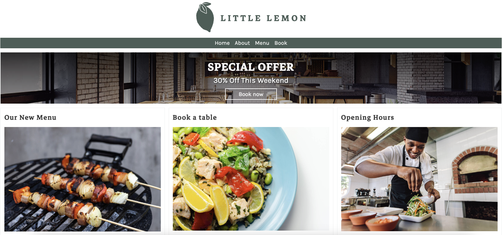
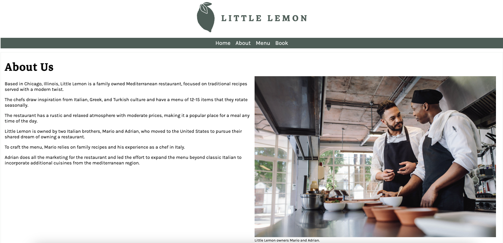
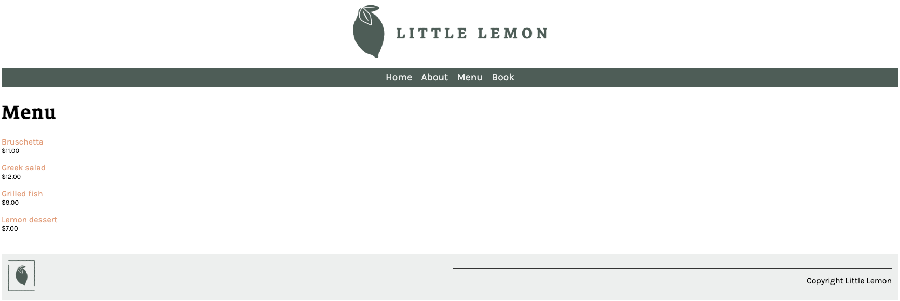
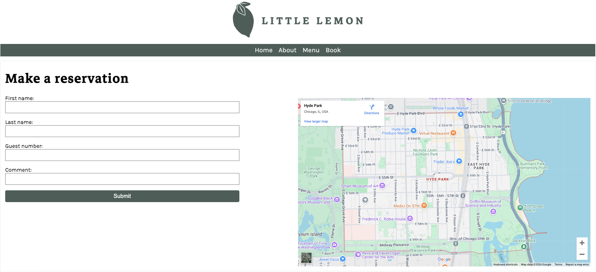

# Little Lemon Restaurant Website

A Django-based web application for the Little Lemon restaurant and optional deployment of the app to Azure Kubernetes Services (AKS)

## Features

### Homepage
- Navigation links to `About`, `Menu`, and `Book` pages.
- Special offers and quick navigation sections.



### About Us Page
- Details about the restaurant's history and inspiration.



### Menu Page
- Lists menu items in alphabetical order with names and prices.
- Clickable links for detailed menu item pages.



### Reservation Page
- Allows users to fill in a reservation form with fields like name, guest count, and comments.
- Integrated Google Maps for location visualization.



---

## Installation & Setup

### Clone the repository and navigate to the project directory:
```bash
git clone https://github.com/haravindanjain/littlelemon.git
cd littlelemon
```

### Create and activate a virtual environment:
```bash
python3 -m venv venv
source venv/bin/activate  
```

### Install dependencies:
```bash
pip3 install -r requirements.txt
```

### Apply migrations:
```bash
python3 manage.py migrate
```


### Run the server:
```bash
python3 manage.py runserver
```
- Access the app in your browser at: http://127.0.0.1:8000


## Kubernetes Deployment (optional)

Follow these steps to containerize your Django app and run it on AKS.

### Log in to Azure:
```bash
   az login
```

### Create a Resource Group:
```bash
   az group create --name <RESOURCE_GROUP_NAME> --location <LOCATION>
```
Replace `<RESOURCE_GROUP_NAME>` and `<LOCATION>` (e.g., `eastus`).


### Create an AKS Cluster:
```bash
   az aks create \
     --resource-group <RESOURCE_GROUP_NAME> \
     --name <CLUSTER_NAME> \
     --node-count 1 \
     --enable-addons monitoring \
     --generate-ssh-keys
```
   Replace `<RESOURCE_GROUP_NAME>` and `<CLUSTER_NAME>` with your desired cluster name.

### Install kubectl (if not already installed):
```bash
   az aks install-cli
```

### Connect to Your Cluster:
```bash
   az aks get-credentials --resource-group <RESOURCE_GROUP_NAME> --name <CLUSTER_NAME>
```

### Containerize Your Django App:

Apple Silicon Users (M1/M2): If your AKS cluster is on x86 (AMD64), you must build an x86-compatible image.

### (Apple Silicon only) Set the environment variable before building:
```bash
   export DOCKER_DEFAULT_PLATFORM=linux/amd64
```

### Build the Docker image:
```bash
   docker build -t <DOCKER_HUB_USERNAME>/<IMAGE_NAME>:<TAG> .
```

### Push the image to Docker Hub (or any registry):
```bash
   docker push <DOCKER_HUB_USERNAME>/<IMAGE_NAME>:<TAG>
```

### Deploy to AKS Using YAML Manifests:


### Apply the Deployment (Add your docker hub username in the container image path):
```bash
   kubectl apply -f deployment.yaml
```

### Apply the Service:
```bash
   kubectl apply -f service.yaml
```

### Verify the Deployment:

### Check pods:
```bash
   kubectl get pods
```
   Ensure the status shows `Running`.

### Check services:
```bash
   kubectl get services
```
   Note the EXTERNAL-IP for your service.

### Update `ALLOWED_HOSTS` in settings.py:
   - Add the EXTERNAL-IP to `ALLOWED_HOSTS` in `settings.py`:
   - Rebuild, push the image, and reapply the Deployment

### 5. Access the App

Open your browser and navigate to <EXTERNAL-IP>